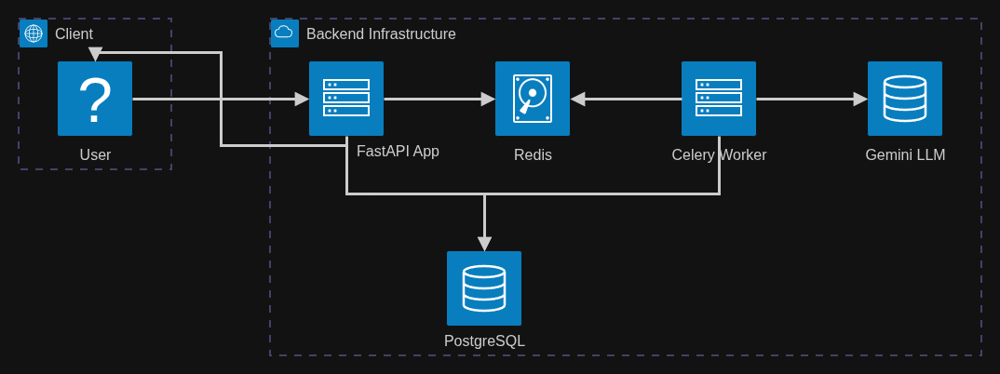

# AI-Powered Transaction Processing Pipeline

This is a backend service for processing CSV files of raw financial transactions asynchronously through a job queue. It cleans data, detects anomalies, and uses Gemini LLM to classify transactions and generate a narrative summary.

## Architecture & Data Flow



1. **Client Upload**: The user uploads a CSV file to the FastAPI `POST /jobs/upload` endpoint.
2. **Database & Queue**: The API instantly creates a Job record in PostgreSQL (status: `pending`) and enqueues a background task into Redis, returning the `job_id` to the user immediately.
3. **Background Processing**: The Celery worker picks up the task from Redis and starts processing the CSV (changing status to `processing`).
4. **Data Cleaning & Anomaly Detection**: The worker normalizes data, detects duplicates, and flags outliers.
5. **LLM Integration**: The worker batches uncategorized transactions and makes an asynchronous call to the **Gemini 3.5 Flash** model (via Interactions API) for classification and to generate a narrative summary of the user's spending.
6. **Final Persistence**: The worker saves all cleaned transactions, anomalies, and the narrative into PostgreSQL, marking the job as `completed`.
7. **Client Polling**: The client polls the `GET /jobs/{job_id}/results` endpoint to retrieve the structured output.

## Tech Stack
- **API Framework**: FastAPI
- **Database**: PostgreSQL
- **Job Queue**: Celery + Redis
- **LLM**: Gemini 1.5 Flash (via `google-generativeai`)
- **Containerisation**: Docker & Docker Compose

## Requirements
- Docker and Docker Compose installed on your machine.
- A Gemini API Key.

## Setup Instructions

1. Clone the repository.
2. Create a `.env` file in the root directory (if not exists) and add your Gemini API key:
   ```env
   GEMINI_API_KEY=your_actual_api_key
   ```
3. Run the following command to build and start the entire stack:
   ```bash
   docker compose up --build -d
   ```

The API will be available at `http://localhost:8000`.

## API Documentation
Once the server is running, you can visit `http://localhost:8000/docs` to see the auto-generated Swagger UI and test endpoints directly.

## Example Curl Requests

### 1. Upload a CSV file
```bash
curl -X 'POST' \
  'http://localhost:8000/jobs/upload' \
  -H 'accept: application/json' \
  -H 'Content-Type: multipart/form-data' \
  -F 'file=@transactions.csv'
```

### 2. Check Job Status
```bash
curl -X 'GET' 'http://localhost:8000/jobs/<job_id>/status' -H 'accept: application/json'
```

### 3. Get Job Results
```bash
curl -X 'GET' 'http://localhost:8000/jobs/<job_id>/results' -H 'accept: application/json'
```

### 4. List all Jobs
```bash
curl -X 'GET' 'http://localhost:8000/jobs?status=completed' -H 'accept: application/json'
```
